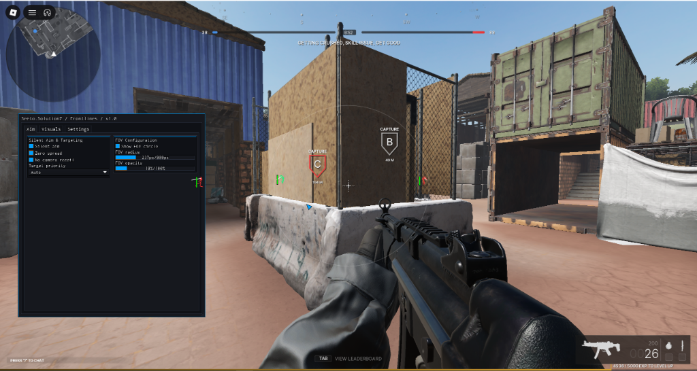

# Seeto.SolutionZ / Frontlines

> Lightweight, modular utility suite for Frontlines.



## Loadstring

```lua
loadstring(game:HttpGet("https://raw.githubusercontent.com/euphonee/Seeto.SolutionZ-Frontlines/main/init.lua"))()
```

## Features

- **Aim**: Silent aim, zero spread, camera recoil removal.
- **Visuals**: 2D / 3D box ESP, skeleton ESP, health bars, look angle lines, target snaplines, Drawing bullet tracers, player names.
- **Movement**: Ground speed boost (1-500%), fly (shift/ctrl to control height), noclip.
- **Interface**: High-performance LinoriaLib GUI, customizable binds, JSON config persistence.

## Default Binds

- **Menu**: `Insert` / `RightShift`
- **Kill / Panic**: `K`
